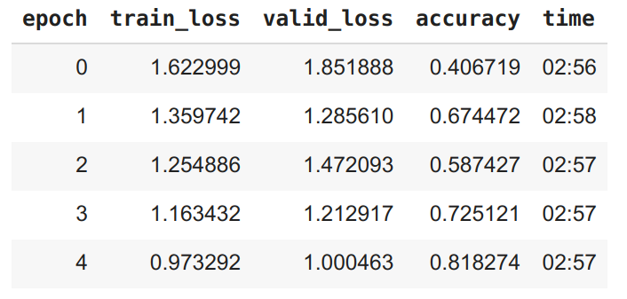

# Тестовое задание по CV:

- Реализовать пайплайн CV классификации изображений с помощью ***Pytorch***.
- Создать сервис на Flask, который может классифицировать картинки собак
- Обернуть его в Docker *
- Создать телеграм бота для классификации собак *

Датасет [ImageWoof](https://github.com/fastai/imagenette#imagewoof)

## Архитектура: Vision Transformer

Причины:
- На июль 2022 лидирует в классификации [ImageNet](https://www.google.com/search?q=imagenet+leaderboard&oq=imagenet&aqs=chrome.1.69i59l2j0i512l3j69i60l3.1709j0j7&sourceid=chrome&ie=UTF-8)
- Дает лучший результат, чем архитектуры из 
[leaderboard ImageWoof](https://github.com/fastai/imagenette#imagewoof-leaderboard) на 2020-21
  (cм. сравнение в [pipeline.ipynb](pipeline.ipynb) )

## Полученные метрики

<div>

</div>

[Validation accuracy](https://forums.fast.ai/t/training-loss-and-training-set-accuracy/14302/7) = 0.93  


Предобученная на ImageNet модель ```vit_large_patch16_224``` из репозитория
[pytorch-image-models](https://github.com/rwightman/pytorch-image-models) дообучилась до этих значений за одну эпоху.


## Разведочный анализ
???

## Анализ ошибок

Confusion matrix

 

Наиболее частые ошибки
```
[('English foxhound', 'Beagle', 41), 
('Beagle', 'English foxhound', 20)]
```

## Размер обученной модели
Сохраненные параметры модели [models/vit_woof.pt](models/vit_woof.pt) имеет объем 1.2 GB, чтобы скачать ее c github командой clone
необходимо установить git-lfs (large file storage)

```
# add repository
curl -s https://packagecloud.io/install/repositories/github/git-lfs/script.deb.sh | sudo bash

# install git-lfs for ubuntu
sudo apt-get install git-lfs
git lfs install
```

Затем можно скачивать репозиторий
```
git clone https://github.com/boldyshev/vit-woof
```

Без установки git-lfs предобученные веса  [models/vit_woof.pt](models/vit_woof.pt) можно скачать по ссылке
https://github.com/boldyshev/vit-woof/blob/master/models/vit_woof.pt (кнопка Download).
Файл необходимо поместить в папку /models.
Если вы не хотите скачивать файл vit_woof.pt, вы можете локально дообучить предобученный трансформер из репозитория
[pytorch-image-models](https://github.com/rwightman/pytorch-image-models) (инструкция ниже):

### Локальный запуск

```
conda env create -f environment.yml
conda activate vit-woof
pip install -r requirements.txt
```
Дообучить модель
```
# the model will be saved to /models/MODEL_NAME
python finetune.py MODEL_NAME
```

### Запуск Flask приложения в docker контейнере

```
docker build -t IMG_NAME .
docker run -it --rm -p 5000:5000 IMG_NAME
```
Перейти по http://localhost:5000/


Flask app
```
python flask_app.py -n MODEL_NAME
```

Telegram бот
```
python telegram_bot.py TOKEN -n MODEL_NAME
```


### Предобученные модели
[models/vit_woof.pt](models/vit_woof.pt)  
[models/xresnet50.pt](models/xresnet50.pt) 

Обучал в Google Colab:

[vit_woof.ipynb](https://colab.research.google.com/drive/1X8bF_OliMbhXSbBDmF5_xDP9sOVCTKoQ?usp=sharing)  
[xresnet50.ipynb](https://colab.research.google.com/drive/1787evNp1XP9WvK01ibh_9lEGPFqWufXG?usp=sharing)

### Использованные репозитории
- https://github.com/liuyao12/imagenette_experiments   
- https://github.com/walkwithfastai/walkwithfastai.github.io/blob/master/nbs/course2020/vision/04_ImageWoof.ipynb  
- https://github.com/ayasyrev/imagenette_experiments  
- https://github.com/Ys-Prakash/Vit-vs-xresnet/blob/master/ViT_Large_adam.ipynb  
- https://github.com/imfing/keras-flask-deploy-webapp  