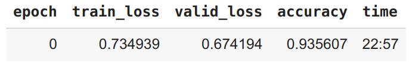
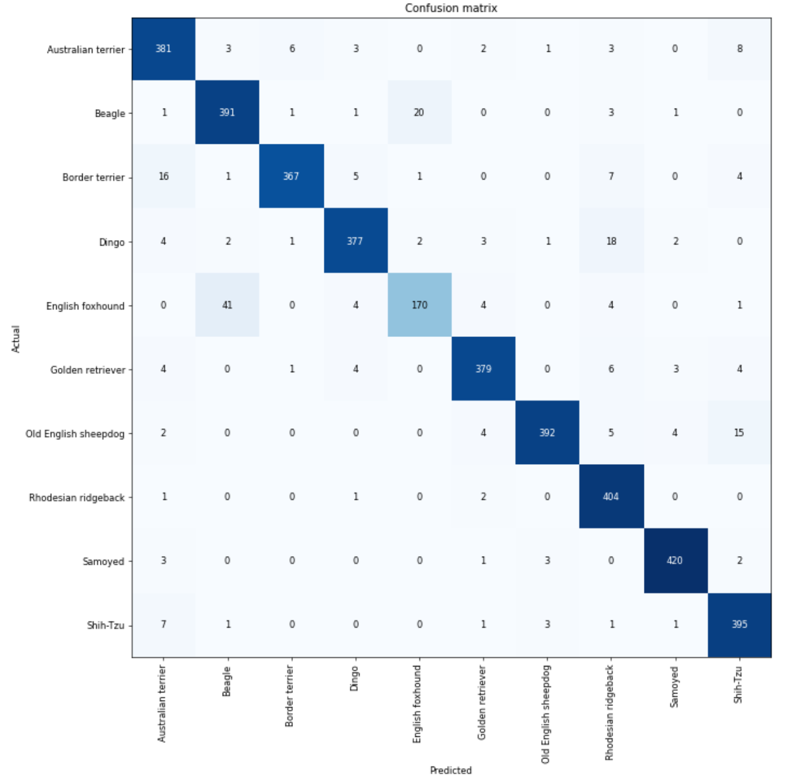

# Тестовое задание по CV:

- Реализовать пайплайн CV классификации изображений с помощью ***Pytorch***.
- Создать сервис на Flask, который может классифицировать картинки собак
- Обернуть его в Docker *
- Создать телеграм бота для классификации собак *

Датасет [ImageWoof](https://github.com/fastai/imagenette#imagewoof)

## Пайплайн
В пайплайне 2 модели: первая классифицирует собак и не собак, 
вторая определяет одну из 10 пород ImageWoof. Обе модели Vision Transformer: первый 
пердобучен на 1000 классах ImageNet, второй -- он же, дообученный на 10 классах ImageWoof.

## Выбор архитектуры

- На июль 2022 модели на основе Vision Transformer лидируют в классификации [ImageNet](https://www.google.com/search?q=imagenet+leaderboard&oq=imagenet&aqs=chrome.1.69i59l2j0i512l3j69i60l3.1709j0j7&sourceid=chrome&ie=UTF-8)
- Vision Transformer лучший результат, чем архитектуры из 
[leaderboard ImageWoof](https://github.com/fastai/imagenette#imagewoof-leaderboard) на 2020-21
  (cм. сравнение в [pipeline.ipynb](pipeline.ipynb) )

## Полученные метрики

Точность классификации ImageWoof:
<div>

</div>

[Validation accuracy](https://forums.fast.ai/t/training-loss-and-training-set-accuracy/14302/7) = 0.93  

Предобученная на ImageNet модель ```vit_large_patch16_224``` из репозитория
[pytorch-image-models](https://github.com/rwightman/pytorch-image-models) дообучилась до этих значений за одну эпоху.

## Разведочный анализ
Датасет ImageWoof содержит изображения 10 классов собак, является подмножеством ImageNet, который 
содержит 1000 классов, из них собаки cосредоточены между 151 и 268 классами 
([ImageNet Classes](https://deeplearning.cms.waikato.ac.nz/user-guide/class-maps/IMAGENET/)).
Модели, предобученные на ImageNet достаточно хорошо определяют наличие собаки на картинке, но недостаточно
хорошо различают 10 искомых классов ImageWoof.


## Анализ ошибок

Confusion matrix

 

Наиболее частые ошибки
```
[('English foxhound', 'Beagle', 41), 
('Beagle', 'English foxhound', 20)]
```

## Локальный запуск
Обе модели имеют объем 1.2 GB, ограничение github -- 50 МB на один файл. 
Большие файлы можно загружать искачивать, установив [git lfs](https://git-lfs.github.com/):

```
# add repository
curl -s https://packagecloud.io/install/repositories/github/git-lfs/script.deb.sh | sudo bash

# install git-lfs for ubuntu
sudo apt-get install git-lfs
git lfs install
```
После этого предобученные модели загрузятся при клонировании репозитория.
```
git clone https://github.com/boldyshev/vit-woof

# go to project directory
cd vit-woof
```
Если вы не хотите устанавливать git lfs, можно скачать модели по ссылке:
```
# the files need to reside in vit-woof/models directory
wget https://github.com/boldyshev/vit-woof/raw/master/models/vit-dog.pt
wget https://github.com/boldyshev/vit-woof/raw/master/models/vit-woof.pt
```

### Запуск Flask приложения в docker контейнере

```
docker build -t IMG_NAME .
docker run -it --rm -p 5000:5000 IMG_NAME
```
Перейти по http://localhost:5000/

Если вы не хотите скачивать предобученные модели, вы можете локально дообучить предобученный трансформер из репозитория
[pytorch-image-models](https://github.com/rwightman/pytorch-image-models) (инструкция ниже):


### Создание виртуальной среды

```
conda env create -f environment.yml
conda activate vit-woof
pip install telebot pyTelegramBotAPI

```
Дообучить модель
```
# the model will be saved to /models/MODEL_NAME
python finetune.py MODEL_NAME
```

Flask app
```
python flask_app.py -n MODEL_NAME
```

Telegram бот
```
python telegram_bot.py TOKEN -n MODEL_NAME
```

### Обучал в Google Colab:

[vit_woof.ipynb](https://colab.research.google.com/drive/1X8bF_OliMbhXSbBDmF5_xDP9sOVCTKoQ?usp=sharing)  
[xresnet50.ipynb](https://colab.research.google.com/drive/1787evNp1XP9WvK01ibh_9lEGPFqWufXG?usp=sharing)

### Использованные репозитории
- https://github.com/liuyao12/imagenette_experiments   
- https://github.com/walkwithfastai/walkwithfastai.github.io/blob/master/nbs/course2020/vision/04_ImageWoof.ipynb  
- https://github.com/ayasyrev/imagenette_experiments  
- https://github.com/Ys-Prakash/Vit-vs-xresnet/blob/master/ViT_Large_adam.ipynb  
- https://github.com/imfing/keras-flask-deploy-webapp  